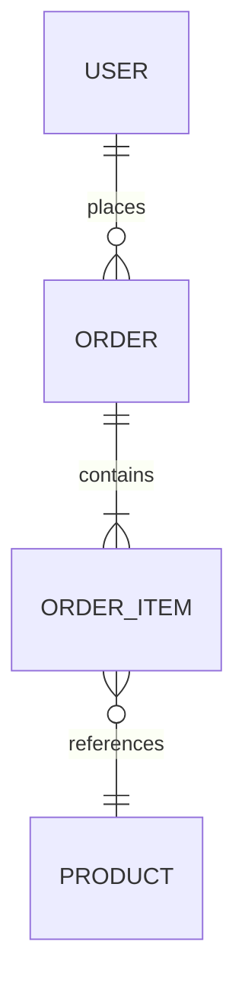
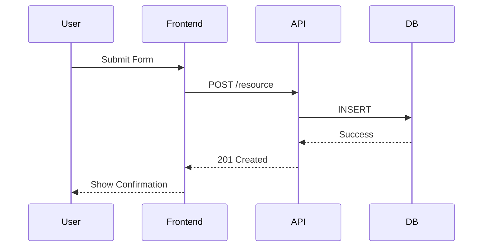

# PRD Architect

Crea Documentos de Requisitos de Producto profesionales adaptados a la complejidad del proyecto.

---

## El Trabajo

1. **Analizar Contexto:** Leer archivos técnicos disponibles (`schema.prisma`, `types.ts`, `package.json`)
2. **Detectar Complejidad:** Determinar modo Simple o Complejo
3. **Clarificar:** Hacer 3-5 preguntas esenciales
4. **Generar:** Crear PRD estructurado según el modo
5. **Guardar:** Exportar a `/tasks/prd-[nombre-feature].md`

**Regla de Oro:** Lógica y Datos antes que UI. Nunca definir un botón sin antes definir la transacción que dispara.

---

## Paso 0: Análisis de Contexto

Antes de preguntar, **lee los archivos del proyecto** para entender el stack:

```bash
# Archivos a buscar
schema.prisma    # Modelo de datos existente
types.ts         # Interfaces TypeScript
package.json     # Dependencias y framework
tsconfig.json    # Configuración del proyecto
```

Extrae:
- Framework (Next.js, Vite, etc.)
- ORM y base de datos
- Patrones de estado existentes
- Convenciones de código

---

## Paso 1: Detección de Complejidad

Determina el modo basándote en:

| Indicador | Simple | Complejo |
|-----------|--------|----------|
| Modifica tablas existentes | ❌ | ✅ |
| Requiere nuevas APIs | ❌ | ✅ |
| Integración con terceros | ❌ | ✅ |
| Estado global/real-time | ❌ | ✅ |
| Multi-rol (RBAC) | ❌ | ✅ |
| Keywords usuario | "feature", "agregar" | "sistema", "arquitectura" |

**Pregunta al usuario si no está claro:**

```text
He analizado el proyecto. ¿Qué tipo de PRD necesitas?

A. **Simple** - Feature acotada, sin cambios de esquema, implementable en 1-2 días
B. **Complejo** - Sistema nuevo, requiere diseño de datos/APIs, múltiples fases
```

---

## Paso 2: Preguntas Clarificadoras

### Modo Simple

Enfocadas en producto y scope:

```text
1. ¿Cuál es el objetivo principal de esta feature?
   A. Mejorar experiencia de usuario
   B. Aumentar conversión/retención
   C. Reducir carga de soporte
   D. Otro: [especificar]

2. ¿Quién es el usuario objetivo?
   A. Usuarios nuevos
   B. Usuarios existentes
   C. Todos los usuarios
   D. Solo administradores

3. ¿Cuál es el alcance deseado?
   A. Versión mínima viable (MVP)
   B. Implementación completa
   C. Solo backend/API
   D. Solo UI/frontend
```

### Modo Complejo

Enfocadas en arquitectura y constraints:

```text
1. Estrategia de Datos:
   A. Extiende tabla existente (relación 1:N)
   B. Requiere esquema/tablas nuevas
   C. Sin persistencia (solo cliente)

2. Interacción y Estado:
   A. CRUD simple (Request/Response)
   B. Real-time / WebSocket requerido
   C. Wizard multi-paso (persistencia local)

3. Control de Acceso:
   A. Público / Abierto
   B. Solo usuarios autenticados
   C. Basado en roles (RBAC)

4. Integraciones:
   A. Solo APIs internas
   B. Servicios externos (especificar)
   C. Webhooks entrantes
```

---

## Paso 3: Estructura del PRD

### PRD Simple

Ver [template-simple.md](resources/template-simple.md) para plantilla completa.

**Secciones:**

1. **Introducción** - Qué y por qué
2. **Objetivos** - Metas medibles
3. **Historias de Usuario** - US-001 con criterios de aceptación
4. **Requisitos Funcionales** - FR-1, FR-2 numerados
5. **No-Objetivos** - Fuera de scope explícito
6. **Consideraciones Técnicas** - Dependencias, constraints
7. **Métricas de Éxito** - KPIs medibles
8. **Preguntas Abiertas**

---

### PRD Complejo

Ver [template-complex.md](resources/template-complex.md) para plantilla completa.

**Secciones:**

#### 1. Resumen Ejecutivo
- Contexto y problema
- Scope (In-Scope vs Out-of-Scope)
- Métricas de éxito

#### 2. Arquitectura del Sistema

**OBLIGATORIO: Diagramas Mermaid**





#### 3. Diccionario de Datos e Interfaces

**Esquema de Base de Datos:**

```sql
CREATE TABLE orders (
  id UUID PRIMARY KEY DEFAULT gen_random_uuid(),
  user_id UUID REFERENCES users(id),
  status TEXT CHECK (status IN ('pending', 'processing', 'done')),
  created_at TIMESTAMPTZ DEFAULT now()
);
```

**Interfaces TypeScript:**

```typescript
interface Order {
  id: string;
  userId: string;
  status: 'pending' | 'processing' | 'done';
  items: OrderItem[];
  createdAt: string;
}

interface OrderItem {
  productId: string;
  quantity: number;
  unitPrice: number;
}
```

#### 4. Contratos de API / Server Actions

| Endpoint | Método | Input | Output | Permisos |
|----------|--------|-------|--------|----------|
| `/api/orders` | POST | `CreateOrderDTO` | `Order` | `user:authenticated` |
| `/api/orders/:id` | GET | - | `Order` | `owner \| admin` |

**Validación (Zod):**

```typescript
const CreateOrderSchema = z.object({
  items: z.array(z.object({
    productId: z.string().uuid(),
    quantity: z.number().min(1)
  })).min(1)
});
```

#### 5. Historias por Fases

**Fase 1: Fundación (DB, API, Lógica)**
- Migraciones y tipos
- CRUD básico
- Validaciones

**Fase 2: Integración (Estado y Hooks)**
- Data fetching frontend
- Stores/caching
- Optimistic updates

**Fase 3: UI e Interacción**
- Componentes
- Pantallas
- Feedback loops

**Formato de Historia:**

```markdown
### US-F1-001: [Título]
**Descripción:** Como [rol], quiero [acción] para [beneficio].

**Contexto Técnico:**
- Endpoint: `POST /api/resource`
- Tabla: `resources`
- Manejo de error: Retornar 409 si duplicado

**Criterios de Aceptación:**
- [ ] **Happy Path:** Datos se guardan correctamente en DB
- [ ] **Edge Case:** Maneja timeout de red con retry
- [ ] **Estado UI:** Muestra skeleton/spinner mientras carga
- [ ] **Validación:** Muestra mensaje específico por error
- [ ] **Verificación:** Verificar en navegador usando skill dev-browser
```

#### 6. Seguridad y NFRs

- **RBAC:** Matriz de permisos por rol
- **Performance:** Queries indexados, carga < 200ms
- **Reliability:** Manejo de race conditions

#### 7. Preguntas Abiertas / Riesgos

---

## Escritura para Desarrolladores Junior

El lector puede ser un desarrollador junior o un agente AI. Por tanto:

- Sé explícito y sin ambigüedad
- Evita jerga o explícala
- Proporciona suficiente detalle para entender propósito y lógica
- Numera requisitos para fácil referencia
- Usa ejemplos concretos

---

## Output

- **Formato:** Markdown (`.md`)
- **Ubicación:** `/tasks/`
- **Nombre archivo:** `prd-[nombre-feature].md` (kebab-case)

---

## Checklist de Generación

Antes de guardar, verificar:

### PRD Simple
- [ ] Preguntas clarificadoras con opciones letradas
- [ ] Respuestas del usuario incorporadas
- [ ] Historias pequeñas y específicas
- [ ] Requisitos funcionales numerados
- [ ] Non-goals definen límites claros
- [ ] Guardado en `/tasks/prd-[nombre].md`

### PRD Complejo
- [ ] Diagrama Mermaid de datos o flujo incluido
- [ ] Modelos de datos e interfaces TS definidos
- [ ] Historias agrupadas por Fase (Backend → Frontend)
- [ ] Edge Cases (errores, loading) listados en criterios
- [ ] Contratos de API documentados
- [ ] Guardado en `/tasks/prd-[nombre].md`

---

## Recursos

- [Plantilla Simple](resources/template-simple.md)
- [Plantilla Compleja](resources/template-complex.md)
- [Ejemplo PRD Simple](examples/prd-simple-example.md)
- [Ejemplo PRD Complejo](examples/prd-complex-example.md)
