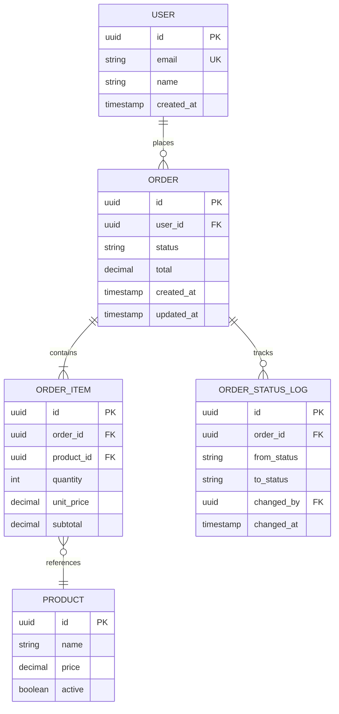
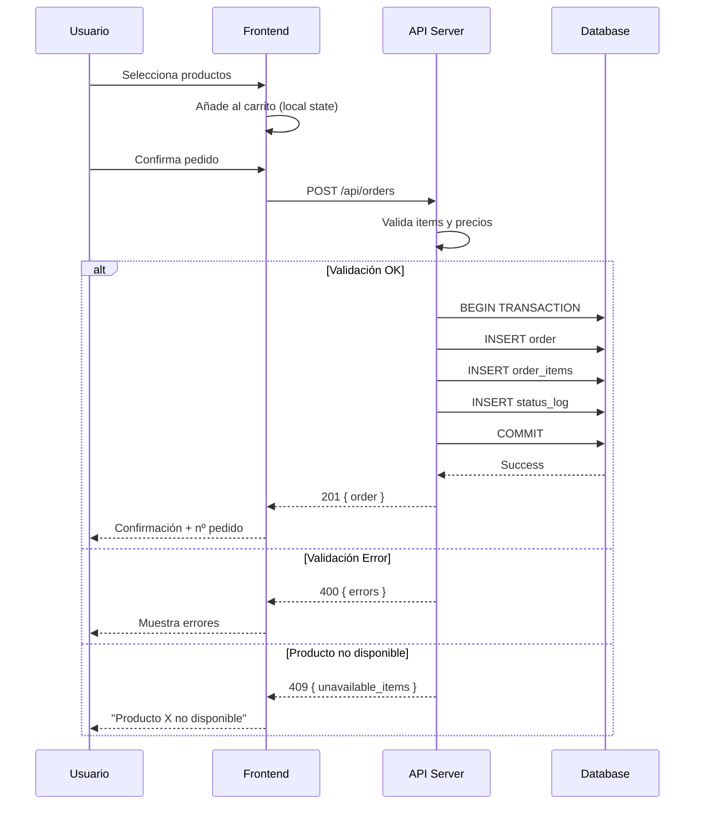

# PRD: Sistema de Gestión de Pedidos (Order Management)

## 1. Resumen Ejecutivo

### Contexto
La plataforma necesita un sistema robusto de gestión de pedidos que permita a los usuarios crear, seguir y gestionar pedidos de productos. Actualmente el proceso es manual y propenso a errores.

### Scope

**In-Scope:**
- Creación de pedidos con múltiples productos
- Seguimiento de estado del pedido
- Historial de pedidos del usuario
- Gestión de pedidos por administradores

**Out-of-Scope:**
- Integración con pasarelas de pago (fase 2)
- Sistema de devoluciones
- Notificaciones push
- Gestión de inventario

### Métricas de Éxito
- Reducción de errores en pedidos en 80%
- Tiempo de creación de pedido < 2 minutos
- 100% trazabilidad de estados

---

## 2. Arquitectura del Sistema

### Modelo de Datos (ERD)



### Flujo de Creación de Pedido



---

## 3. Diccionario de Datos

### Esquema de Base de Datos

```sql
-- Tipo enum para estados
CREATE TYPE order_status AS ENUM (
    'pending',      -- Creado, pendiente de proceso
    'confirmed',    -- Confirmado por el sistema
    'processing',   -- En preparación
    'shipped',      -- Enviado
    'delivered',    -- Entregado
    'cancelled'     -- Cancelado
);

-- Tabla de pedidos
CREATE TABLE orders (
    id UUID PRIMARY KEY DEFAULT gen_random_uuid(),
    user_id UUID NOT NULL REFERENCES users(id),
    status order_status NOT NULL DEFAULT 'pending',
    total DECIMAL(10,2) NOT NULL DEFAULT 0,
    notes TEXT,
    created_at TIMESTAMPTZ NOT NULL DEFAULT now(),
    updated_at TIMESTAMPTZ NOT NULL DEFAULT now()
);

-- Items del pedido
CREATE TABLE order_items (
    id UUID PRIMARY KEY DEFAULT gen_random_uuid(),
    order_id UUID NOT NULL REFERENCES orders(id) ON DELETE CASCADE,
    product_id UUID NOT NULL REFERENCES products(id),
    quantity INTEGER NOT NULL CHECK (quantity > 0),
    unit_price DECIMAL(10,2) NOT NULL,
    subtotal DECIMAL(10,2) GENERATED ALWAYS AS (quantity * unit_price) STORED,
    created_at TIMESTAMPTZ NOT NULL DEFAULT now()
);

-- Log de cambios de estado
CREATE TABLE order_status_log (
    id UUID PRIMARY KEY DEFAULT gen_random_uuid(),
    order_id UUID NOT NULL REFERENCES orders(id) ON DELETE CASCADE,
    from_status order_status,
    to_status order_status NOT NULL,
    changed_by UUID REFERENCES users(id),
    notes TEXT,
    changed_at TIMESTAMPTZ NOT NULL DEFAULT now()
);

-- Índices
CREATE INDEX idx_orders_user ON orders(user_id);
CREATE INDEX idx_orders_status ON orders(status);
CREATE INDEX idx_orders_created ON orders(created_at DESC);
CREATE INDEX idx_order_items_order ON order_items(order_id);
CREATE INDEX idx_status_log_order ON order_status_log(order_id);

-- RLS
ALTER TABLE orders ENABLE ROW LEVEL SECURITY;

CREATE POLICY "Users can view own orders" ON orders
    FOR SELECT USING (auth.uid() = user_id);

CREATE POLICY "Users can create own orders" ON orders
    FOR INSERT WITH CHECK (auth.uid() = user_id);
```

### Interfaces TypeScript

```typescript
// Tipos base
export type OrderStatus = 
  | 'pending' 
  | 'confirmed' 
  | 'processing' 
  | 'shipped' 
  | 'delivered' 
  | 'cancelled';

export interface Order {
  id: string;
  userId: string;
  status: OrderStatus;
  total: number;
  notes?: string;
  items: OrderItem[];
  statusLog?: OrderStatusLog[];
  createdAt: string;
  updatedAt: string;
}

export interface OrderItem {
  id: string;
  orderId: string;
  productId: string;
  product?: Product;
  quantity: number;
  unitPrice: number;
  subtotal: number;
}

export interface OrderStatusLog {
  id: string;
  orderId: string;
  fromStatus?: OrderStatus;
  toStatus: OrderStatus;
  changedBy?: string;
  notes?: string;
  changedAt: string;
}

// DTOs
export interface CreateOrderDTO {
  items: Array<{
    productId: string;
    quantity: number;
  }>;
  notes?: string;
}

export interface UpdateOrderStatusDTO {
  status: OrderStatus;
  notes?: string;
}

// Response types
export interface OrderListResponse {
  orders: Order[];
  total: number;
  page: number;
  pageSize: number;
}
```

---

## 4. Contratos de API

### Endpoints

| Método | Endpoint | Input | Output | Auth |
|--------|----------|-------|--------|------|
| POST | `/api/orders` | `CreateOrderDTO` | `Order` | `user` |
| GET | `/api/orders` | `?page&status` | `OrderListResponse` | `user` |
| GET | `/api/orders/:id` | - | `Order` | `owner\|admin` |
| PATCH | `/api/orders/:id/status` | `UpdateOrderStatusDTO` | `Order` | `admin` |
| DELETE | `/api/orders/:id` | - | `void` | `owner` (solo pending) |

### Validación con Zod

```typescript
import { z } from 'zod';

export const CreateOrderSchema = z.object({
  items: z.array(z.object({
    productId: z.string().uuid(),
    quantity: z.number().int().min(1).max(100)
  })).min(1, "Debe incluir al menos un producto"),
  notes: z.string().max(500).optional()
});

export const UpdateOrderStatusSchema = z.object({
  status: z.enum([
    'pending', 'confirmed', 'processing', 
    'shipped', 'delivered', 'cancelled'
  ]),
  notes: z.string().max(500).optional()
});

// Transiciones de estado válidas
export const VALID_STATUS_TRANSITIONS: Record<OrderStatus, OrderStatus[]> = {
  pending: ['confirmed', 'cancelled'],
  confirmed: ['processing', 'cancelled'],
  processing: ['shipped', 'cancelled'],
  shipped: ['delivered'],
  delivered: [],
  cancelled: []
};
```

### Respuestas de Error

| Código | Condición | Body |
|--------|-----------|------|
| 400 | Items vacíos o cantidad inválida | `{ error: "Validation failed", details: [...] }` |
| 401 | No autenticado | `{ error: "Unauthorized" }` |
| 403 | No es owner ni admin | `{ error: "Forbidden" }` |
| 404 | Pedido no existe | `{ error: "Order not found" }` |
| 409 | Producto no disponible | `{ error: "Product unavailable", productId: "..." }` |
| 422 | Transición de estado inválida | `{ error: "Invalid status transition", from: "...", to: "..." }` |

---

## 5. Historias de Usuario por Fases

### Fase 1: Fundación (DB, API, Lógica Core)

#### US-F1-001: Migración de esquema de pedidos
**Descripción:** Como desarrollador, necesito las tablas de DB para persistir pedidos.

**Contexto Técnico:**
- Migración: `migrations/20260125_create_orders.sql`
- Tablas: `orders`, `order_items`, `order_status_log`
- RLS habilitado con políticas owner

**Criterios de Aceptación:**
- [ ] Migración ejecuta sin errores en Supabase
- [ ] Constraints CHECK aplicados (quantity > 0)
- [ ] Columna computed `subtotal` funciona
- [ ] Índices creados para queries frecuentes
- [ ] RLS permite solo ver pedidos propios
- [ ] `npm run typecheck` pasa

#### US-F1-002: API de creación de pedidos
**Descripción:** Como sistema, necesito endpoint para crear pedidos con validación transaccional.

**Contexto Técnico:**
- Endpoint: `POST /api/orders`
- Transacción: INSERT order → INSERT items → INSERT log
- Validar precios actuales de productos

**Criterios de Aceptación:**
- [ ] **Happy Path:** Pedido creado con items y total calculado
- [ ] **Validación:** 400 si items vacíos o cantidad < 1
- [ ] **Concurrencia:** 409 si producto inactivo durante transacción
- [ ] **Atomicidad:** Rollback si falla cualquier INSERT
- [ ] Status log inicial registrado
- [ ] `npm run typecheck` pasa

#### US-F1-003: API de cambio de estado
**Descripción:** Como admin, necesito cambiar el estado de pedidos con trazabilidad.

**Contexto Técnico:**
- Endpoint: `PATCH /api/orders/:id/status`
- Validar transiciones permitidas
- Registrar en status_log

**Criterios de Aceptación:**
- [ ] **Happy Path:** Estado cambia y se registra en log
- [ ] **Transición inválida:** 422 con estados from/to
- [ ] **Permisos:** 403 si no es admin
- [ ] Log incluye usuario que hizo el cambio
- [ ] `npm run typecheck` pasa

---

### Fase 2: Integración (Estado, Hooks, Cache)

#### US-F2-001: Hook useOrders con paginación
**Descripción:** Como frontend, necesito listar pedidos del usuario con filtros.

**Contexto Técnico:**
- Hook: `useOrders(options: { status?, page? })`
- React Query con cache 5 min
- Invalidar al crear pedido

**Criterios de Aceptación:**
- [ ] Retorna `{ orders, total, isLoading, error }`
- [ ] Filtra por status si se especifica
- [ ] Paginación funcional (10 por página)
- [ ] Cache invalidation en mutaciones
- [ ] `npm run typecheck` pasa

#### US-F2-002: Hook useCreateOrder con optimistic update
**Descripción:** Como frontend, necesito crear pedidos con feedback inmediato.

**Contexto Técnico:**
- Hook: `useCreateOrder()`
- Optimistic: añadir a lista antes de confirm
- Rollback si error

**Criterios de Aceptación:**
- [ ] Retorna `{ mutate, isLoading, error }`
- [ ] Pedido aparece inmediatamente en lista
- [ ] Rollback si API retorna error
- [ ] Toast de éxito/error
- [ ] `npm run typecheck` pasa

---

### Fase 3: UI e Interacción

#### US-F3-001: Carrito de compras (client-side)
**Descripción:** Como usuario, quiero añadir productos a un carrito antes de confirmar.

**Contexto Técnico:**
- Estado: Zustand store `useCartStore`
- Persistencia: localStorage
- Componente: `CartDrawer`

**Criterios de Aceptación:**
- [ ] Añadir/quitar productos del carrito
- [ ] Actualizar cantidades
- [ ] Total calculado en tiempo real
- [ ] Persiste entre recargas (localStorage)
- [ ] Vaciar carrito tras crear pedido
- [ ] `npm run typecheck` pasa
- [ ] Verificar en navegador usando skill dev-browser

#### US-F3-002: Pantalla de historial de pedidos
**Descripción:** Como usuario, quiero ver mi historial de pedidos con estados.

**Contexto Técnico:**
- Página: `/orders`
- Componente: `OrdersListPage`
- Usa hook `useOrders`

**Criterios de Aceptación:**
- [ ] Lista paginada de pedidos
- [ ] Badge de estado con color según status
- [ ] Filtro por estado (dropdown)
- [ ] Click para ver detalle
- [ ] Skeleton mientras carga
- [ ] Empty state si no hay pedidos
- [ ] `npm run typecheck` pasa
- [ ] Verificar en navegador usando skill dev-browser

#### US-F3-003: Pantalla de detalle de pedido
**Descripción:** Como usuario, quiero ver el detalle completo de un pedido.

**Contexto Técnico:**
- Página: `/orders/:id`
- Componente: `OrderDetailPage`
- Timeline de estados

**Criterios de Aceptación:**
- [ ] Muestra todos los items con subtotales
- [ ] Total del pedido
- [ ] Timeline visual de cambios de estado
- [ ] Botón cancelar si status = pending
- [ ] 404 page si pedido no existe
- [ ] `npm run typecheck` pasa
- [ ] Verificar en navegador usando skill dev-browser

---

## 6. Seguridad y Requisitos No Funcionales

### Control de Acceso (RBAC)

| Acción | User | Owner | Admin |
|--------|:----:|:-----:|:-----:|
| Crear pedido | ✅ | - | ✅ |
| Ver pedidos propios | ✅ | ✅ | ✅ |
| Ver todos los pedidos | ❌ | ❌ | ✅ |
| Cancelar pedido propio | ❌ | ✅* | ✅ |
| Cambiar estado | ❌ | ❌ | ✅ |

*Solo si status = 'pending'

### Performance

- Lista de pedidos < 200ms (paginación obligatoria)
- Creación de pedido < 500ms
- Índices en `user_id`, `status`, `created_at`

### Reliability

- Transacciones atómicas para crear pedido
- Optimistic locking para cambios de estado
- Log de auditoría inmutable

### Integridad

- Precios congelados al momento de crear pedido (unit_price en order_items)
- No borrado físico de pedidos (soft delete futuro)
- status_log append-only

---

## 7. Preguntas Abiertas / Riesgos

- [ ] ¿Integrar con inventario para validar stock en tiempo real?
- [ ] ¿Límite de items por pedido? (propuesta: 50)
- [ ] ¿Tiempo máximo para cancelar pedido pending? (propuesta: 24h)
- [ ] ¿Notificación por email al cambiar estado? (fase 2)

---

## Apéndice

### Colores de Estado

| Status | Color | Icono |
|--------|-------|-------|
| pending | amber | ⏳ |
| confirmed | blue | ✓ |
| processing | indigo | 🔄 |
| shipped | purple | 📦 |
| delivered | green | ✅ |
| cancelled | red | ❌ |
