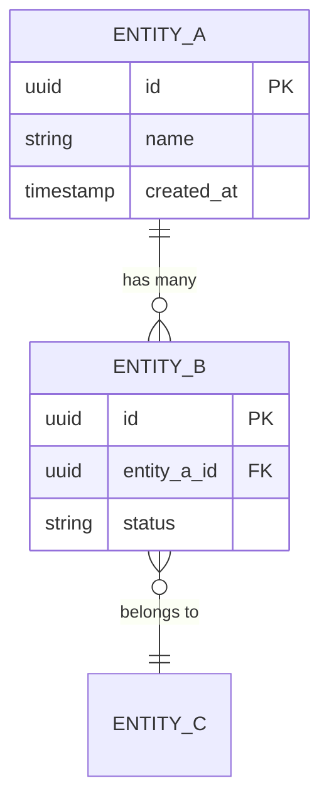
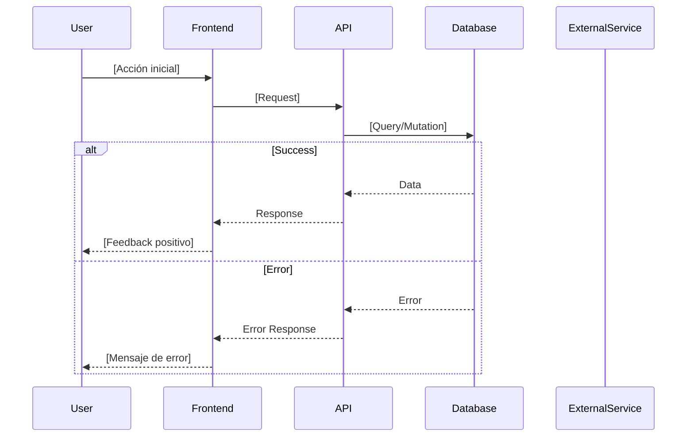

# PRD: [Nombre del Sistema/Feature Compleja]

## 1. Resumen Ejecutivo

### Contexto
[Por qué estamos construyendo esto. Problema de negocio o técnico que resuelve.]

### Scope

**In-Scope:**
- [Capacidad principal 1]
- [Capacidad principal 2]

**Out-of-Scope:**
- [Exclusión explícita 1]
- [Exclusión explícita 2]

### Métricas de Éxito
- [KPI medible 1]
- [KPI medible 2]

---

## 2. Arquitectura del Sistema

### Modelo de Datos (ERD)



### Flujo Principal



---

## 3. Diccionario de Datos

### Esquema de Base de Datos

```sql
-- Tabla principal
CREATE TABLE entity_a (
    id UUID PRIMARY KEY DEFAULT gen_random_uuid(),
    name TEXT NOT NULL,
    status TEXT NOT NULL DEFAULT 'draft' 
        CHECK (status IN ('draft', 'active', 'archived')),
    created_at TIMESTAMPTZ NOT NULL DEFAULT now(),
    updated_at TIMESTAMPTZ NOT NULL DEFAULT now()
);

-- Tabla relacionada
CREATE TABLE entity_b (
    id UUID PRIMARY KEY DEFAULT gen_random_uuid(),
    entity_a_id UUID NOT NULL REFERENCES entity_a(id) ON DELETE CASCADE,
    data JSONB NOT NULL DEFAULT '{}',
    created_at TIMESTAMPTZ NOT NULL DEFAULT now()
);

-- Índices requeridos
CREATE INDEX idx_entity_b_entity_a ON entity_b(entity_a_id);
```

### Interfaces TypeScript

```typescript
// Tipos compartidos Frontend/Backend
export interface EntityA {
  id: string;
  name: string;
  status: 'draft' | 'active' | 'archived';
  createdAt: string;
  updatedAt: string;
}

export interface EntityB {
  id: string;
  entityAId: string;
  data: Record<string, unknown>;
  createdAt: string;
}

// DTOs para API
export interface CreateEntityADTO {
  name: string;
}

export interface UpdateEntityADTO {
  name?: string;
  status?: EntityA['status'];
}
```

---

## 4. Contratos de API

### Endpoints

| Método | Endpoint | Input | Output | Auth |
|--------|----------|-------|--------|------|
| POST | `/api/entities` | `CreateEntityADTO` | `EntityA` | `user` |
| GET | `/api/entities/:id` | - | `EntityA` | `user` |
| PATCH | `/api/entities/:id` | `UpdateEntityADTO` | `EntityA` | `owner` |
| DELETE | `/api/entities/:id` | - | `void` | `admin` |

### Validación

```typescript
import { z } from 'zod';

export const CreateEntityASchema = z.object({
  name: z.string().min(1).max(255)
});

export const UpdateEntityASchema = z.object({
  name: z.string().min(1).max(255).optional(),
  status: z.enum(['draft', 'active', 'archived']).optional()
});
```

### Respuestas de Error

| Código | Condición | Body |
|--------|-----------|------|
| 400 | Validación fallida | `{ error: string, details: ZodError }` |
| 401 | No autenticado | `{ error: "Unauthorized" }` |
| 403 | Sin permisos | `{ error: "Forbidden" }` |
| 404 | No encontrado | `{ error: "Not Found" }` |
| 409 | Conflicto (duplicado) | `{ error: "Conflict", field: string }` |

---

## 5. Historias de Usuario por Fases

### Fase 1: Fundación (DB, API, Lógica Core)

#### US-F1-001: Crear migración de base de datos
**Descripción:** Como desarrollador, necesito el esquema de DB para persistir los datos.

**Contexto Técnico:**
- Archivo: `migrations/YYYYMMDD_create_entities.sql`
- Tablas: `entity_a`, `entity_b`
- Índices según esquema

**Criterios de Aceptación:**
- [ ] Migración ejecuta sin errores
- [ ] Constraints y defaults aplicados
- [ ] Índices creados
- [ ] `npm run typecheck` pasa

#### US-F1-002: Implementar CRUD API
**Descripción:** Como sistema, necesito endpoints para gestionar entidades.

**Contexto Técnico:**
- Endpoints: POST, GET, PATCH, DELETE
- Validación: Zod schemas
- Errores: Códigos HTTP estándar

**Criterios de Aceptación:**
- [ ] **Happy Path:** CRUD funciona correctamente
- [ ] **Validación:** Retorna 400 con detalles de error
- [ ] **Auth:** Retorna 401/403 según corresponda
- [ ] **Edge Case:** Retorna 404 si no existe
- [ ] `npm run typecheck` pasa

---

### Fase 2: Integración (Estado, Hooks, Cache)

#### US-F2-001: Crear hooks de data fetching
**Descripción:** Como frontend, necesito hooks para consumir la API.

**Contexto Técnico:**
- Hooks: `useEntities`, `useEntity`, `useCreateEntity`
- Cache: React Query / SWR
- Optimistic updates donde aplique

**Criterios de Aceptación:**
- [ ] Loading states manejados
- [ ] Error states manejados
- [ ] Cache invalidation en mutaciones
- [ ] `npm run typecheck` pasa

---

### Fase 3: UI e Interacción

#### US-F3-001: Crear pantalla de listado
**Descripción:** Como usuario, quiero ver todas mis entidades para gestionarlas.

**Contexto Técnico:**
- Componente: `EntitiesListPage`
- Usa hook `useEntities`
- Tabla con acciones

**Criterios de Aceptación:**
- [ ] Muestra loading skeleton mientras carga
- [ ] Muestra mensaje vacío si no hay datos
- [ ] Acciones: Ver, Editar, Eliminar
- [ ] Confirmación antes de eliminar
- [ ] `npm run typecheck` pasa
- [ ] Verificar en navegador usando skill dev-browser

---

## 6. Seguridad y Requisitos No Funcionales

### Control de Acceso (RBAC)

| Acción | User | Owner | Admin |
|--------|:----:|:-----:|:-----:|
| Crear | ✅ | ✅ | ✅ |
| Leer propios | ✅ | ✅ | ✅ |
| Leer todos | ❌ | ❌ | ✅ |
| Editar | ❌ | ✅ | ✅ |
| Eliminar | ❌ | ❌ | ✅ |

### Performance

- Queries deben estar indexados
- Tiempo de carga inicial < 200ms
- Paginación para listas > 50 items

### Reliability

- Manejo de race conditions en updates concurrentes
- Retry automático en errores de red (3 intentos)
- Graceful degradation si servicio externo no disponible

---

## 7. Preguntas Abiertas / Riesgos

- [ ] [Pregunta arquitectónica pendiente]
- [ ] [Dependencia externa a confirmar]
- [ ] [Decisión de diseño que necesita input]

---

## Apéndice

### Referencias
- [Link a diseños/mockups]
- [Documentación de API externa]
- [Especificación técnica relacionada]
