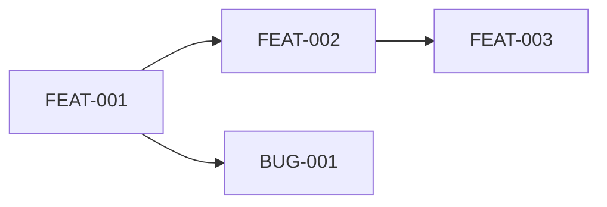

# Plantilla: tracks.md (Registro de Tracks)

```markdown
# Registro de Tracks

> Última actualización: [YYYY-MM-DD HH:MM]

## Resumen

| Métrica | Valor |
|---------|-------|
| Tracks Activos | [N] |
| Tracks Completados | [N] |
| Tracks Archivados | [N] |

---

## Tracks Activos

### En Progreso

| ID | Título | Fase | Progreso | Asignado | Inicio |
|----|--------|------|----------|----------|--------|
| FEAT-001 | [Título] | 2/3 | 65% | [Nombre] | [Fecha] |

### Pendientes

| ID | Título | Prioridad | Estimación | Bloqueado Por |
|----|--------|-----------|------------|---------------|
| FEAT-002 | [Título] | Alta | 3d | - |
| BUG-001 | [Título] | Media | 4h | FEAT-001 |

---

## Tracks Completados (sin archivar)

| ID | Título | Completado | Duración | Notas |
|----|--------|------------|----------|-------|
| FEAT-000 | [Título] | [Fecha] | 5d | [Notas] |

---

## Tracks Archivados

Ver [_archive/](./tracks/_archive/) para tracks archivados.

| ID | Título | Archivado | Razón |
|----|--------|-----------|-------|
| FEAT-OLD | [Título] | [Fecha] | Completado y desplegado |

---

## Track Dependencies



---

## Próximos Tracks (Backlog)

| Prioridad | ID Propuesto | Título | Descripción |
|-----------|--------------|--------|-------------|
| 1 | FEAT-003 | [Título] | [Descripción breve] |
| 2 | TECH-001 | [Título] | [Descripción breve] |

---

## Historial de Cambios

| Fecha | Acción | Track | Detalles |
|-------|--------|-------|----------|
| [Fecha] | Creado | FEAT-001 | Nuevo track de autenticación |
| [Fecha] | Completado | FEAT-000 | Cerrado tras QA |
| [Fecha] | Archivado | FEAT-OLD | Movido a archivo |
```
